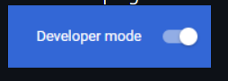
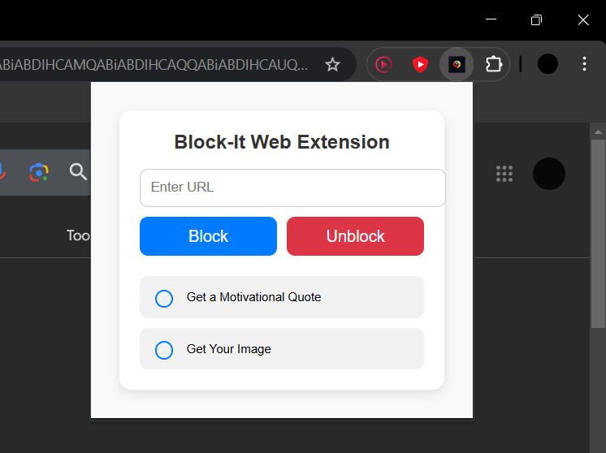

# Block-It Web Extension

**Block-It** is a simple and fun Chrome extension that replaces blocked websites with a **motivational quote** or a **funny meme image**. It's designed to help you stay productive by giving you a little boost when you're trying to access a website that isn't allowed.

## Features

- **Block Access to Certain Websites**: Specify the websites that need to be blocked for productivity.
- **Motivational Quotes**: Display a random motivational quote whenever you try to access a blocked website.
- **Funny Meme Images**: Optionally, show a random meme image to bring a smile to your face when you try to visit a blocked site.
- **Customizable**: Easily customize the extension to fit your preferences by modifying the list of blocked websites, choosing between a quote or meme, and more.

## Installation

You need to follow some simple steps for installation :

    Download the code by clicking on the green button.

3. After, downloading the zip file unzip it (right click -> extract here) and then navigate to chrome://extensions.

4. On the top right corner there will be a option for Developer Mode. Switch it on if it is not.
   

5. After that click on `load unpacked` option on the top left corner.
   

6. Select the folder you downloaded. And then click on Puzzle button on the top right corner. Click on it and Pin this extension so that you can use it anytime.
   

7. it's done. Have Fun🥳🎉`
